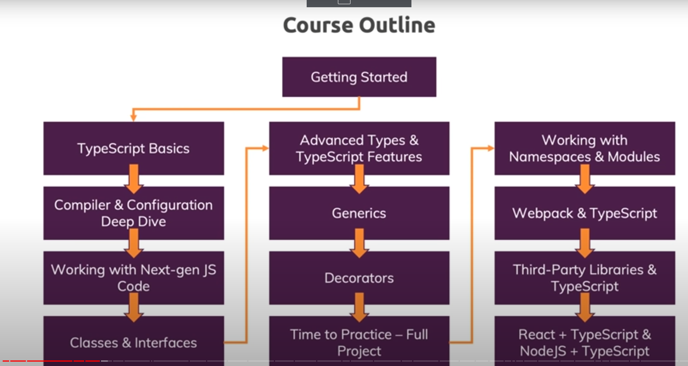
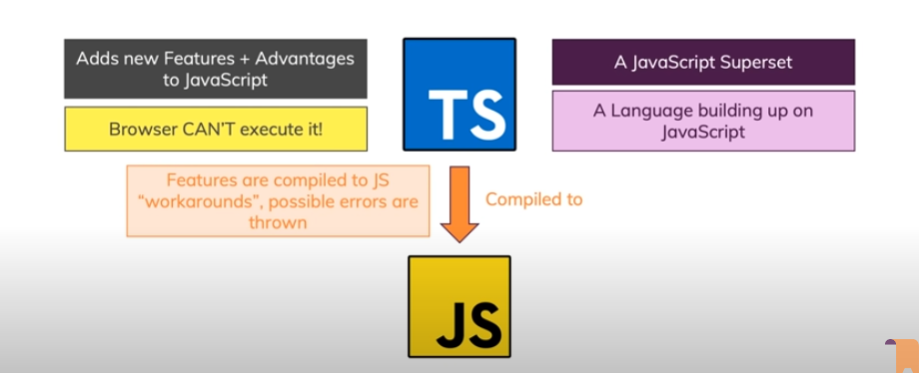
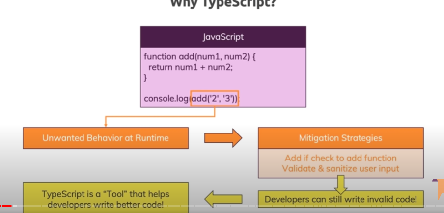
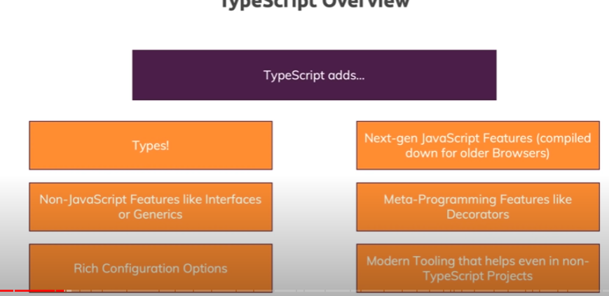

# Course Outline



# TypeScript

- A JS Superset
- A language building up on JavaScript
- Adds new features + advantages to JavaScript
- Browser CAN'T execute TypeScript :( 
- Features are compiled to JS "workarounds", possible errors are thrown



## Why TypeScript?


## TypeScript Overview


# Core Types
- number: All numbers, no differentiation between intergers or loats.
- string: All text values
- boolean: true, false. no "truthy, falsy" values

1. JavaScript uses "dynamic types" (resolved at runtime), TypeScript uses "static types" (set during development)

2. TypeScript perfectly can understand the types of input in const, let, therefore no need to clare :type... do it only when passing values as parameters

```js
let number1 = 5 ; //TypeScript understands the type straight away

let number1 : number; // declare number1 type before it's defined
number1 = 5;
```

3. Tuple: Added by TypeScript: Fixed-length array